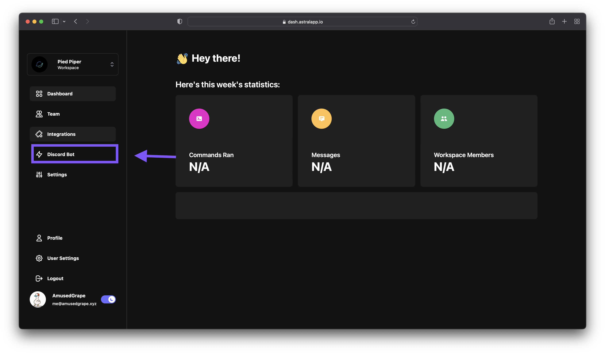
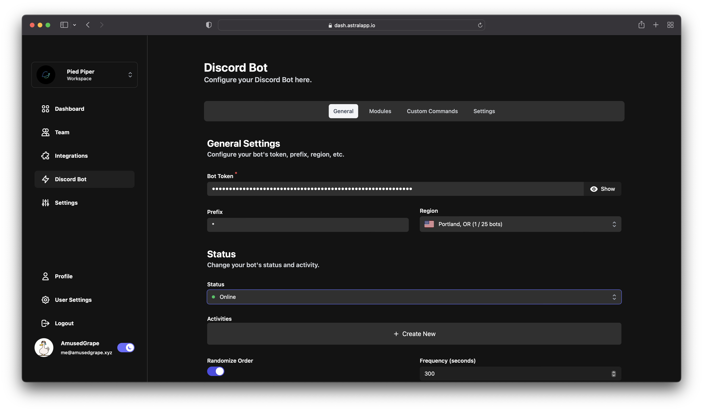

### Introduction
If you haven't created a [workspace](/docs/get-started/quick-start) yet, do that first!.

### Creating a bot

Click on the "Discord Bot" tab in the sidebar.

You can now input your bot credentials and a prefix, then select a region for the bot, and a server to add it to.

Then you can click "Create Bot".

(If you're on Safari, the pop-up to add the bot to the server may not show. Either allow the pop-up or you can go to the bot settings and add it manually.)

And you're done! Your bot has been created.

