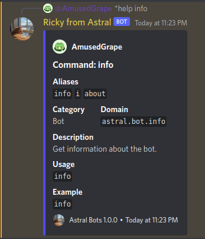

## Introduction

Astral uses a powerful domain-based, granular permissions system. This means that you can control permissions on a per-domain basis, and you can control permissions on a per-command basis. This allows you to have a very fine-grained control over what your users can and cannot do.

For example, you can give a user or role the permission to run the `kick` command, but not the `ban` command. You can also give a user or role the permission to run the `kick` command in the `moderation` domain, but not the `ban` command in the `moderation` domain.

To do this, you can do the following:

```diff
+astral.moderation.kick
-astral.moderation.ban

# or

+astral.moderation.*
-astral.moderation.ban
```

By default, Astral comes with a set of default permissions that are assigned to all users. These permissions are as follows:

```diff
+astral.*
-astral.moderation.*
```

This is for safety reasons. If you do not give a user or role any permissions, they will not be able to do anything. This is to prevent users from accidentally locking themselves out of the bot.

To get a command's domain, simply run `help <command>` (prefixed with your custom prefix). It should return an embed similar to this:



## Syntax

The syntax for permissions is as follows:

```diff
+astral.<category>.<command>
-astral.<category>.<command>
```

For your convenience, you can use the `*` wildcard to give a user or role access to all commands in a category. For example, if you want to give a user or role access to all moderation commands, you can do the following:

```diff
+astral.moderation.*
```

The permissions text input will not let you add a permission that is not in valid syntax.
