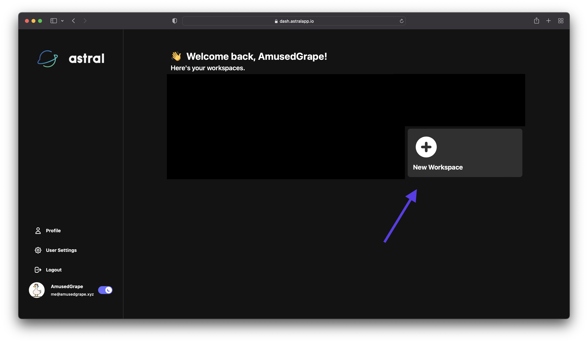
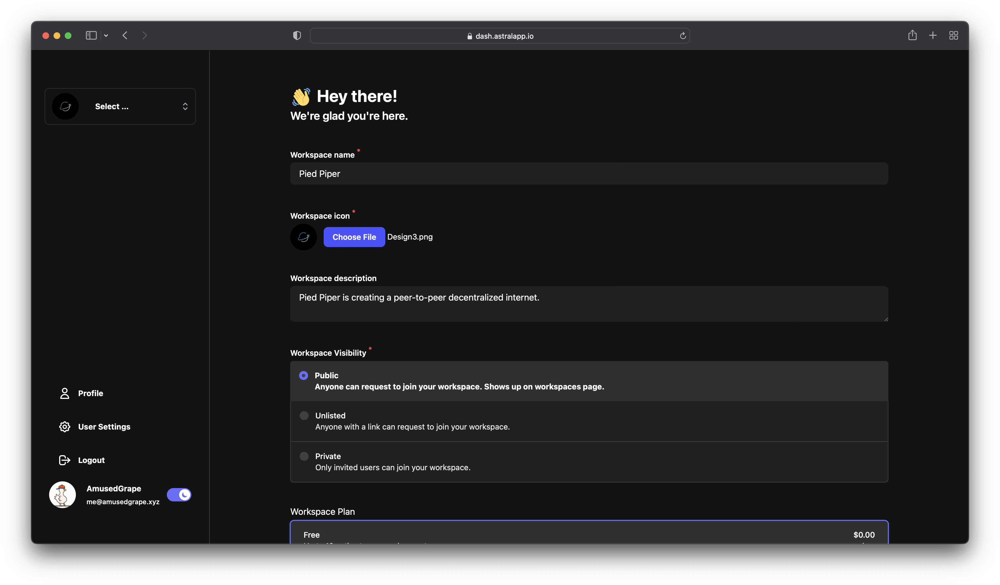
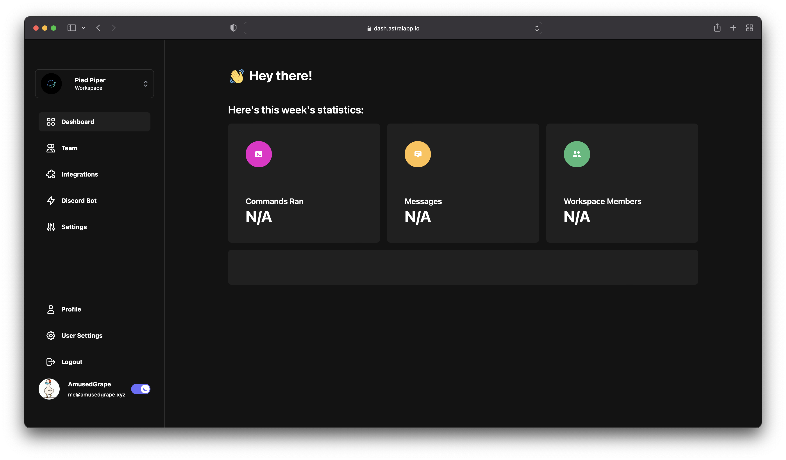

### Getting to the Dashboard

First, you need to sign in to Astral with your Discord account.

After you have signed in, click "Continue to Dashboard"

### Creating a workspace

Now that you are on the dashboard, you can create a new workspace.

(note: if you have no workspaces, the button will not be on the right!)

You can now easily enter the details for your new workspace and click "Create Workspace".

Congrats! You've now created your workspace.

