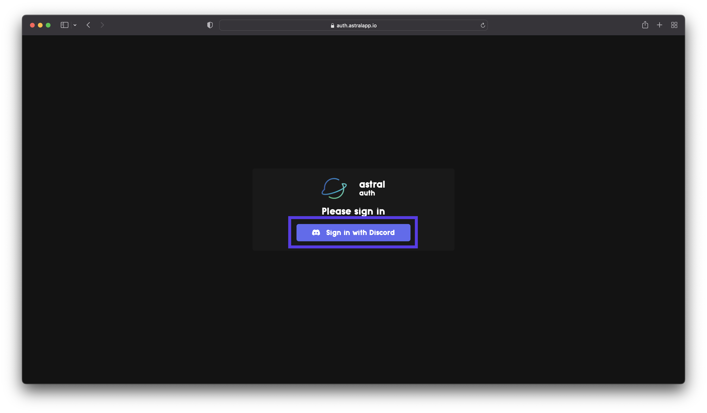

### Getting to the Dashboard

First, you need to sign in to Astral with your Discord account.

If you're on Safari, our authentication service may not work correctly. To fix this, disable Website Tracking in Safari settings.

Please note that we never track you, this is a limitation of our current authentication system and how it works, and rest assured that we are working on a fix.

After you have signed in, click "Continue to Dashboard"

