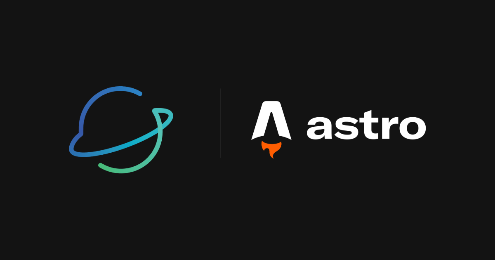

## What's new

We've completely rewritten the dashboard and authentication sites in [Astro](https://astro.build) and have rewritten the API in [Go](https://go.dev/) (thanks to it's high performace).

The main website (astralapp.io) will be updated in the coming days.

## What's removed

We removed the UI logic for adding personalization to your user profile. This was not needed, and was not intended for initial release.

## What's changed

We have reworked some of the UI for integrations and bot management. This was primarily done to keep the Javascript amount low.

## What's coming

We have much more coming in the future. Stay tuned to our web*sites* for updates.
